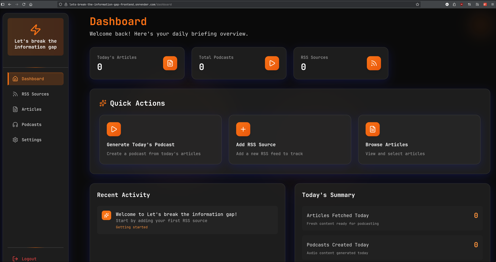

# Let's break the information gap.

A web application that transforms RSS feeds into personalized multi-speaker podcasts, helping users stay informed through audio content based on their interests.

[Official website](https://lbtig.kingportal.tech/)

Here is a demo podcast:  

https://github.com/user-attachments/assets/6a2bdf09-957c-48b4-bfb1-8c8c541e9a7e

## Features
- **Personalized Podcast Feeds**: Fetch articles from any number of RSS sources into a single, coherent audio experience.
- **Quick Actions**: Generate daily podcast in one single step, include fetch daily news from RSS sources.
- **AI-Powered TTS Service**: Use the most advanced gemini 2.5 pro model to generate podcast scripts and podcasts.
- **Dynamic Multi-Speaker Audio**: The podcast has one host and one client with different voices.

## Quick start
1. Sign up your account
2. Obtain your Google Gemini API from the [Google AI Studio](https://aistudio.google.com/apikey)
3. Go to setting page and save your gemini api
4. Go to the "RSS Sources" page and add the URLs of your favorite blogs, news sites, or other feeds.
5. Now you can generate your personal daily podcast

## Roadmap
- **2025-09**: Migrate deployment from Render to my personal server ✅ - 2025.09.21
- **2025-10**: Add more social medias RSS feeds
- **2025-12**: Multi-format input file support
- **Future**:
  - Use fine-tuning TTS model
  - Improve user experience
  - Support spotify export
